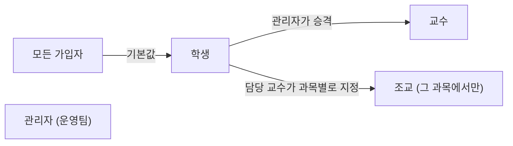
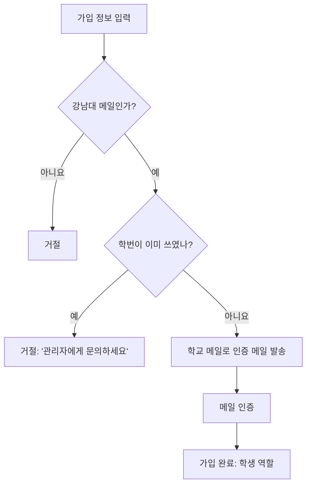
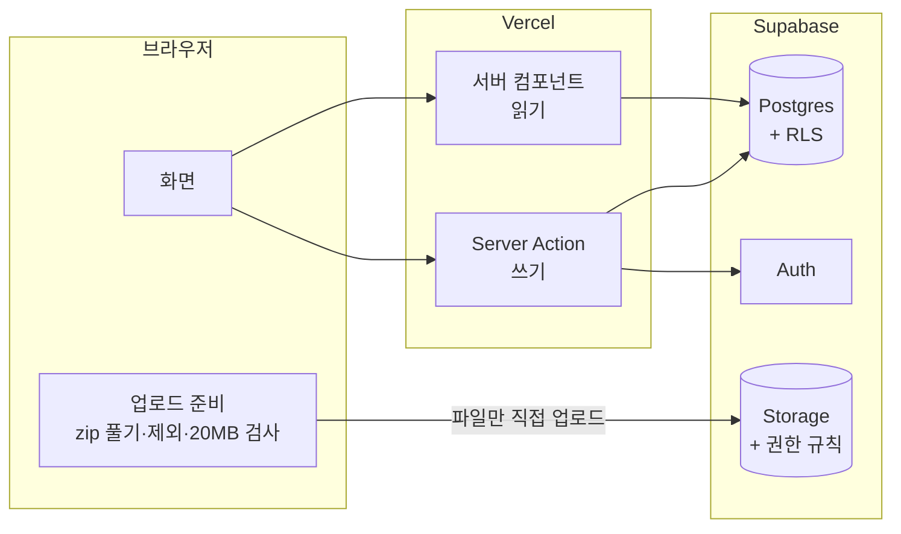
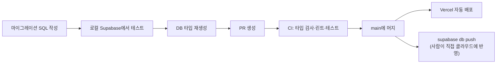
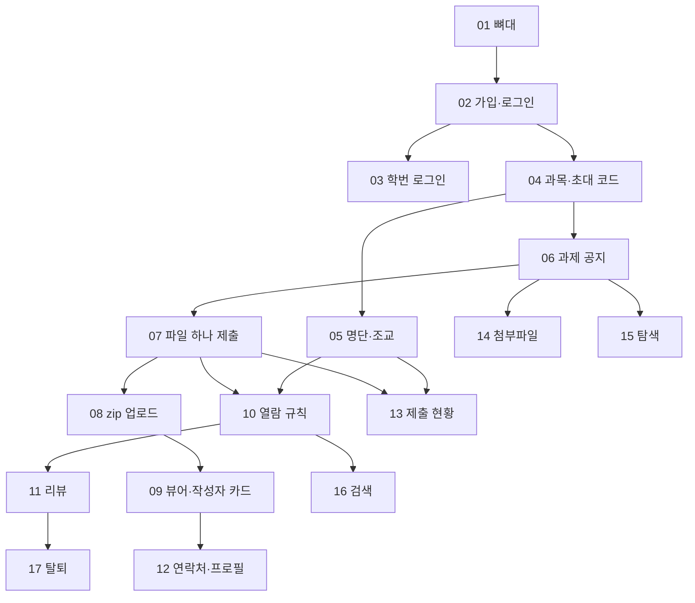
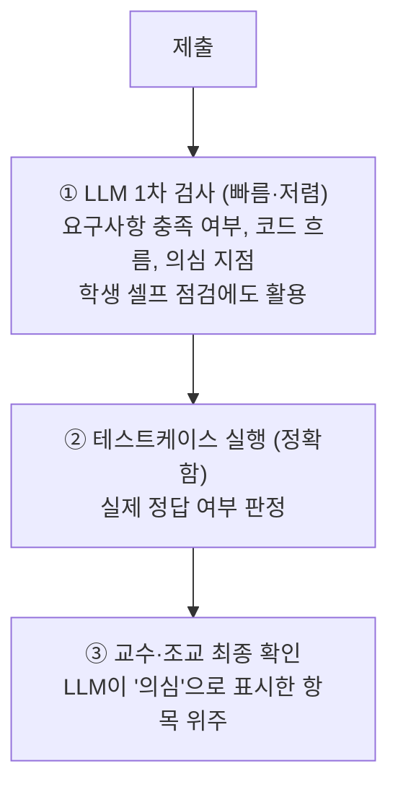

# 강남대 과제 공유 & 리뷰 플랫폼: 상세 기획서

> **한 줄 정의**: 강남대 학교 메일로 가입해 과제를 올리면 누가 만든 건지 바로 보이고, 교수와 학생의 리뷰가 쌓이는 **우리 과 전용 과제 아카이브 + 리뷰 플랫폼**

이 문서는 처음 구상한 [과제공유플랫폼_기획.md](과제공유플랫폼_기획.md)에 2026-10-07 논의에서 확정한 내용을 합친 것이다. 처음 구상은 그대로 보존하고, 이 문서를 기준 문서로 쓴다.

| 항목 | 내용 |
|---|---|
| 프로젝트 | 인공지능서비스개발 팀 프로젝트 (knuhub) |
| 대상 학교 | 강남대학교 (`@kangnam.ac.kr`) |
| MVP 목표 시점 | 2026년 12월 초 |
| 레포 | https://github.com/tlgus2882-ctrl/knuhub |
| MVP 스펙 | [이슈 #2](https://github.com/tlgus2882-ctrl/knuhub/issues/2) |
| 구현 티켓 | [이슈 #3~#19](https://github.com/tlgus2882-ctrl/knuhub/issues) (17개) |

**관련 문서**
- [GLOSSARY.md](GLOSSARY.md): 용어 정의 (과목, 과제, 제출물, 공개 범위 등)
- [docs/mvp-spec.md](docs/mvp-spec.md): MVP 결정 요약
- [docs/adr/](docs/adr/): 되돌리기 어려운 기술 결정과 그 이유
- [docs/agents/domain.md](docs/agents/domain.md): 용어와 코드 이름 대응표

---

## 목차

1. [배경과 문제](#1-배경과-문제)
2. [용어](#2-용어)
3. [사용자와 역할](#3-사용자와-역할)
4. [MVP 기능 상세](#4-mvp-기능-상세)
5. [열람·권한 규칙 한눈에 보기](#5-열람권한-규칙-한눈에-보기)
6. [기술 구성](#6-기술-구성)
7. [개발 방식](#7-개발-방식)
8. [구현 티켓과 순서](#8-구현-티켓과-순서)
9. [이후 단계 (v2~v5)](#9-이후-단계-v2v5)
10. [코드 실행 설계 (v2 이후)](#10-코드-실행-설계-v2-이후)
11. [과제 검사 설계 (v3 이후)](#11-과제-검사-설계-v3-이후)
12. [리스크와 대응](#12-리스크와-대응)
13. [아직 정하지 않은 것](#13-아직-정하지-않은-것)

---

## 1. 배경과 문제

| 문제 | GitHub에서는 | 이 서비스에서는 |
|---|---|---|
| 공유·탐색 | 각자 레포라서 링크를 알아야 찾아갈 수 있다 | **학기 → 과목 → 과제** 단위로 모아서 보여 준다 |
| 작성자 식별 | 닉네임만 보여서 실제로 누군지 모른다 | 학교 메일로 인증된 사용자의 **이름과 학번**이 항상 보인다 |
| 피드백 | 이슈·PR은 과제 리뷰 용도로 어색하다 | 제출물마다 **리뷰**를 남긴다 |
| 맥락 | 과제 요구사항과 코드가 따로 있다 | **과제 공지 ↔ 제출물 ↔ 리뷰**가 연결된다 |

**핵심 차별점**
1. 과제라는 단위로 묶인다.
2. 신원이 보장된다.

**MVP가 검증할 가설:** "찾아가지 않아도 보이고, 누가 만들었는지 보인다."

---

## 2. 용어

팀 안에서 같은 말을 쓰기 위해 아래 용어로 통일한다. 정확한 정의는 [GLOSSARY.md](GLOSSARY.md)에 있다.

| 용어 | 뜻 | 쓰지 않는 말 |
|---|---|---|
| **과목** | 학기와 분반까지 포함한 개설 강좌 하나 (예: 2026-2 자료구조 01분반) | 강의, 클래스, 수업 |
| **수강생** | 초대 코드로 과목에 참여한 학생 | |
| **조교** | 특정 과목 안에서만 갖는 역할. 담당 교수가 지정한다 | TA |
| **과제** | 과목 안에서 교수가 공지하는 개인 과제 | 숙제, 프로젝트 |
| **마감일** | 제출이 닫히는 시각 | |
| **공개 범위** | 마감 후 제출물을 누가 볼 수 있는지 교수가 과제마다 정한 값 | 공개 설정 |
| **제출물** | 한 학생이 한 과제에 올린 파일 묶음 (학생·과제당 하나) | 과제물, 결과물 |
| **작성자 카드** | 제출물에 붙어 작성자의 이름·학번·연락처를 보여 주는 표시 | |
| **리뷰** | 제출물에 남기는 피드백. 교수, 조교, 학생 모두 리뷰라고 부른다 | 댓글, 코멘트 |
| **연락처 공개 범위** | 내 연락 수단을 누구에게 보일지 정한 값 | |

---

## 3. 사용자와 역할

### 3.1 역할 구조

| 역할 | 범위 | 어떻게 정해지나 | 할 수 있는 일 |
|---|---|---|---|
| **학생** | 전체 | 가입하면 자동 | 과목 참여, 제출, 리뷰, 탐색·검색 |
| **교수** | 전체 | 관리자가 Supabase 대시보드에서 승격 | 과목 개설, 과제 공지, 수강생·조교 관리, 제출 현황 확인 |
| **조교** | 과목 하나 | 그 과목의 담당 교수가 지정 | 그 과목의 과제 관리, 마감 전 제출물 열람, 제출 현황 확인 |
| **관리자** | 전체 | 운영팀 | 역할 변경, 학번 정정, 전화번호 열람 |

- 과목의 **담당 교수**는 그 과목을 연 교수 한 명이다.
- 조교는 다른 과목에서는 평범한 학생이다.
- 관리자 페이지는 v2에서 만든다. MVP에서는 Supabase 대시보드를 쓴다.

---

## 4. MVP 기능 상세

### 4.1 가입과 로그인

**가입 화면에서 받는 것**

| 항목 | 필수 여부 | 비고 |
|---|---|---|
| 학교 메일 | 필수 | `@kangnam.ac.kr`만 허용 (서버에서 검증) |
| 비밀번호 | 필수 | |
| 이름 | 필수 | |
| 학번 | 학생만 | 다른 사용자와 겹칠 수 없음, 가입 후 본인이 수정할 수 없음 |
| 전화번호 | 필수 | **관리자만** 볼 수 있음 |
| 개인정보 수집 동의 | 필수 | 학번·이름·전화번호·연락처 |

**흐름**

- **로그인:** 아이디 칸에 **학번 또는 학교 메일**을 넣고 비밀번호를 입력한다. 학생은 주로 학번, 교수는 학번이 없으니 메일로 로그인한다.
- **비밀번호 재설정:** 학번이나 메일을 입력하면 가입한 학교 메일로 재설정 링크를 보낸다.
- **학번 중복:** 누군가 남의 학번으로 먼저 가입했다면, 관리자가 전화번호로 당사자에게 연락해 바로잡는다.

> 학번은 본인이 입력하는 값이라 완전한 신원 보장은 아니다. 교수가 수강생 명단에서 학교 메일과 대조해 확인하는 것을 전제로 한다.

### 4.2 프로필과 연락처

- 이름과 연락 수단은 언제든 바꿀 수 있다. 학번과 전화번호는 본인이 바꿀 수 없다.
- 연락 수단은 **학교 메일, 카카오톡 오픈채팅 링크, GitHub 아이디** 중 원하는 것만 등록한다.
- **연락처 공개 범위**

| 값 | 연락 수단이 보이는 사람 |
|---|---|
| 전체 | 로그인한 모든 사용자 |
| 수강생 | 나와 같은 과목에 있는 수강생·교수·조교 |
| 비공개 | 아무도 |

### 4.3 과목

| 항목 | 내용 |
|---|---|
| 입력값 | 과목명, 학기(예: 2026-2), 분반 |
| 개설 | 교수만 가능. 연 교수가 담당 교수 |
| 참여 | 학생이 **초대 코드**를 입력하면 승인 없이 바로 수강생이 된다 |
| 관리 (담당 교수) | 수강생 명단 보기(이름·학번·학교 메일), 수강생 내보내기, 초대 코드 재발급, 조교 지정·해제 |
| 내 과목 목록 | 학생은 참여한 과목, 교수는 담당 과목이 보인다 |

- 같은 이름이라도 학기나 분반이 다르면 **별개의 과목**이다.
- 초대 코드가 밖으로 퍼지면 재발급하고, 들어온 외부인은 내보낸다.

### 4.4 과제

| 항목 | 내용 |
|---|---|
| 만드는 사람 | 담당 교수, 조교 |
| 입력값 | 제목, 설명(마크다운), 마감일, 첨부파일, 공개 범위 |
| 채점 기준표 | 설명 안에 자유 텍스트로 쓴다 (구조화는 v3에서 LLM 검사와 함께) |
| 공개 범위 | 비공개 / **수강생 공개(기본값)** / 학내 공개. 언제든 바꿀 수 있다 |
| 마감일 | 언제든 바꿀 수 있다. 화면에는 한국 시간으로 표시한다 |
| 과제 종류 | 개인 과제만 (팀 과제는 v2 이후) |

### 4.5 제출

| 항목 | 내용 |
|---|---|
| 제출할 수 있는 사람 | 그 과목의 수강생 본인 |
| 방식 | zip 업로드, 또는 폴더·파일 끌어다 놓기. zip은 브라우저에서 푼다 |
| 자동 제외 | `node_modules`, `.git` 등 |
| 용량 | 제외 후 **최대 20MB**. 넘으면 업로드 전에 알려 준다 |
| 개수 | 학생·과제당 제출물 하나 |
| 마감 전 | 몇 번이든 재제출(**덮어쓰기**, 마지막 것만 남음), 삭제 가능 |
| 마감 후 | 제출, 재제출, 삭제 모두 불가 |
| 지각 제출 | 받지 않는다 |

**제출 현황 표:** 담당 교수와 조교는 과제마다 모든 수강생의 제출 여부와 마지막 제출 시각을 표로 본다. 미제출자도 표시된다.

### 4.6 코드 뷰어와 작성자 카드

- **파일 트리**로 제출물을 둘러본다.
- 텍스트 파일은 **문법 하이라이팅 + 줄 번호**로 보여 준다.
- 이미지, 실행 파일 같은 바이너리는 **다운로드 링크**만 제공한다.
- **작성자 카드:** 이름과 학번은 항상 보이고, 연락 수단은 작성자의 연락처 공개 범위에 따라 보인다. 전화번호는 절대 보이지 않는다.

### 4.7 리뷰

| 항목 | 규칙 |
|---|---|
| 쓸 수 있는 사람 | 그 제출물을 **볼 수 있는 사람 누구나** |
| 표시 | 리뷰마다 작성자 이름이 보인다 (익명 리뷰는 v2) |
| 수정 | 리뷰 작성자만 |
| 삭제 | 리뷰 작성자, 그 과목의 담당 교수 |
| 공개 시점 | 제출물과 같다. 마감 전에 교수·조교가 남긴 리뷰는 제출물이 공개될 때 함께 공개된다 |

### 4.8 탐색과 검색

- **탐색:** 로그인한 사용자는 누구나 학기 → 과목 → 과제 순으로 목록을 둘러본다. 수강생이 아니어도 과목·과제 목록은 보이므로, 학내 공개 제출물에 이 경로로 도달할 수 있다.
- **검색:** 과목명, 과제명, 학생 이름·학번으로 찾는다. 볼 권한이 있는 결과만 나오고, 숨겨진 제출물은 존재 자체가 드러나지 않는다. 코드 내용 검색은 하지 않는다.

### 4.9 탈퇴

- 무엇이 지워지는지 경고를 보여 주고 확인을 받는다.
- 탈퇴하면 **프로필, 제출물(파일 포함), 리뷰를 모두 삭제**한다. 다른 사람 제출물에 남긴 리뷰도 사라진다.

---

## 5. 열람·권한 규칙 한눈에 보기

이 서비스에서 가장 중요한 규칙이다. 모든 규칙은 DB의 행 단위 권한(RLS)으로 강제한다 ([ADR-0002](docs/adr/0002-rls-as-single-guard-server-first-data.md)).

### 5.1 제출물을 누가 볼 수 있나

| 보는 사람 | 마감 전 | 마감 후: 비공개 | 마감 후: 수강생 공개 | 마감 후: 학내 공개 |
|---|:---:|:---:|:---:|:---:|
| 작성자 본인 | ✅ | ✅ | ✅ | ✅ |
| 담당 교수 | ✅ | ✅ | ✅ | ✅ |
| 그 과목 조교 | ✅ | ✅ | ✅ | ✅ |
| 같은 과목 다른 수강생 | ❌ | ❌ | ✅ | ✅ |
| 다른 강남대 사용자 | ❌ | ❌ | ❌ | ✅ |
| 로그인하지 않은 사람 | ❌ | ❌ | ❌ | ❌ |

- 공개 여부는 저장해 두지 않고 **항상 현재 마감일과 현재 시각으로 계산**한다.
- 그래서 교수가 마감을 **연장하면** 이미 공개된 제출물이 **다시 숨겨지고 재제출이 다시 열린다**.
- 리뷰도 제출물과 똑같은 규칙을 따른다.

### 5.2 누가 무엇을 할 수 있나

| 할 일 | 학생 | 수강생 | 조교 | 담당 교수 | 관리자 |
|---|:---:|:---:|:---:|:---:|:---:|
| 과목 개설 | | | | ✅ (교수 역할) | |
| 초대 코드로 참여 | ✅ | | | | |
| 수강생 명단 보기·내보내기, 초대 코드 재발급 | | | | ✅ | |
| 조교 지정·해제 | | | | ✅ | |
| 과제 만들기·고치기 | | | ✅ | ✅ | |
| 제출·재제출·삭제 (마감 전) | | ✅ 본인 것 | | | |
| 제출 현황 표 보기 | | | ✅ | ✅ | |
| 리뷰 쓰기 (볼 수 있는 제출물에) | ✅ | ✅ | ✅ | ✅ | |
| 리뷰 지우기 | 내 리뷰 | 내 리뷰 | 내 리뷰 | 내 리뷰 + 자기 과목 리뷰 | |
| 교수 승격, 학번 정정 | | | | | ✅ (대시보드) |
| 전화번호 보기 | | | | | ✅ |

---

## 6. 기술 구성

### 6.1 MVP에서 쓰는 것 (확정)

| 영역 | 기술 | 용도 |
|---|---|---|
| 프론트엔드 | Next.js (App Router), TypeScript, Tailwind CSS | 웹 화면 |
| 화면 컴포넌트 | shadcn/ui | 버튼, 폼, 표, 다이얼로그 |
| 백엔드 | **Supabase**: Postgres + RLS, Auth, Storage | DB, 권한, 인증, 파일 저장 ([ADR-0001](docs/adr/0001-supabase-as-backend.md)) |
| 인증 | Supabase Auth (이메일 + 비밀번호, 메일 인증 1회) | 학교 메일 가입, 학번 로그인 |
| 코드 하이라이팅 | Shiki | 코드 뷰어 |
| 테스트 | Vitest + 로컬 Supabase (CLI + Docker/OrbStack) | 권한 규칙, 업로드 준비 함수 |
| CI | GitHub Actions | PR마다 타입 검사, 린트, 테스트 |
| 배포 | Vercel | `main` 머지 시 자동 배포 |
| 런타임 | Node 24 LTS 이상, npm | |

> 팀원의 `wh` 브랜치에 있던 Neon은 DB만 제공해서 인증과 파일 저장을 따로 붙여야 하므로 채택하지 않았다.

### 6.2 구조

**원칙 ([ADR-0002](docs/adr/0002-rls-as-single-guard-server-first-data.md))**
1. **접근 규칙은 RLS 한곳에만 둔다.** 화면이나 서버 코드에서 규칙을 다시 구현하지 않는다.
2. **데이터는 서버에서 다룬다.** 읽기는 서버 컴포넌트, 쓰기는 Server Action에서 하고, 로그인 세션(쿠키)으로 Supabase를 호출해 RLS가 그대로 적용된다.
3. **예외로 파일 업로드만 브라우저에서 Storage로 바로 보낸다.** 서버를 거치면 Vercel의 요청 크기 제한(약 4.5MB)에 걸린다.
4. **Secret key는 테스트 준비와 관리자 작업에만 쓴다.** RLS를 우회하는 키라 일반 요청에는 쓰지 않는다.

### 6.3 코드 이름

코드(테이블, 타입, 변수)에서는 아래 영어 이름을 쓴다. 전체 표는 [docs/agents/domain.md](docs/agents/domain.md)에 있다.

`profile` · `course` · `enrollment` · `course_assistant` · `assignment` · `due_at` · `visibility`(`private`/`course`/`campus`) · `submission` · `submission_file` · `review` · `contact_visibility`(`public`/`course`/`private`) · `invite_code`

### 6.4 이후 단계에서 붙일 것

| 영역 | 기술 | 단계 |
|---|---|---|
| GitHub 연동 | GitHub OAuth + GitHub API | v2 |
| 코드 편집·라인 리뷰 | Monaco Editor | v2 |
| 버전 비교 | `diff` + react-diff-viewer | v2 |
| 웹 실행 | `<iframe sandbox>` | v2 |
| Python 실행 | Pyodide (WASM) + Web Worker | v2 |
| 알림 | Supabase Realtime + 메일(Resend) | v2 |
| LLM | Claude API (1차 검사는 경량 모델, 요약은 상위 모델) | v3 |
| 작업 큐 | Redis + BullMQ (또는 Supabase Queue) | v3 |
| 서버 실행·채점 | Judge0 또는 Piston + Docker | v4 |
| 표절 검사 | JPlag 또는 MOSS | v4 |
| 검색 고도화 | Meilisearch (필요할 때) | v4 |
| 대화형 터미널 | xterm.js + WebSocket | v5 |
| 모니터링 | Sentry | 시범 운영 전 |

---

## 7. 개발 방식

### 7.1 테스트

| 테스트 | 무엇을 확인하나 | 방법 |
|---|---|---|
| **권한 테스트 (핵심)** | 5장의 모든 규칙 | 로컬 Supabase에 학생 A·B, 조교, 담당 교수, 다른 교수, 관리자, 외부 사용자를 만들고 각자 로그인해서 읽기·쓰기를 시도한다. 마감 전후는 마감일을 과거·미래로 설정해 만든다 |
| **업로드 준비 함수 단위 테스트** | 제외 경로, 20MB 경계값, 텍스트·바이너리 분류, 폴더 구조 유지 | 순수 함수 테스트 |
| 화면 E2E | MVP에서는 하지 않음 | 티켓마다 직접 데모로 확인 |

- 좋은 테스트는 "이 역할의 사용자가 이 시점에 이것을 볼 수 있나, 할 수 있나"처럼 **밖에서 보이는 동작**만 확인한다. 내부 구현을 바꿔도 깨지지 않아야 한다.
- 테스트마다 무작위 메일과 새 데이터를 만들어 서로 섞이지 않게 한다. DB를 초기화하지 않으므로 빠르고 병렬로 돌릴 수 있다.

### 7.2 DB 변경과 배포

- DB 변경은 SQL 마이그레이션 파일로 레포에 둔다.
- 클라우드 Supabase 반영은 MVP 동안 **사람이 직접** 한다. 자동으로 반영하려면 DB 비밀번호를 GitHub에 맡겨야 하고, 실수한 마이그레이션이 바로 운영 DB에 들어가기 때문이다.
- 시각은 시간대 정보를 포함해 저장하고, 화면에는 한국 시간으로 보여 준다.

### 7.3 환경변수

| 이름 | 공개 여부 | 쓰는 곳 |
|---|---|---|
| Supabase Project URL | 공개 | 브라우저, 서버 |
| Supabase Publishable key | 공개 | 브라우저, 서버 |
| Supabase Secret key | **비밀** | 서버의 관리자 작업, 테스트 준비만. 채팅이나 코드에 절대 붙이지 않는다 |

로컬에서는 `.env.local`(커밋 안 됨)에 넣고, Vercel에는 프로젝트 설정에서 넣는다.

### 7.4 작업 흐름

1. GitHub 이슈 목록에서 **막고 있는 티켓이 없는** 티켓을 고른다.
2. `/implement #이슈번호`로 구현한다. 테스트를 먼저 쓰고, 코드 리뷰를 거친다.
3. PR을 올려 CI를 통과시키고 `main`에 머지한다.

---

## 8. 구현 티켓과 순서

티켓은 DB·화면·테스트를 한 번에 관통하는 **기능 단위**로 잘라서, 하나 끝날 때마다 직접 데모해 볼 수 있다. 티켓 제목의 번호(01~17)와 GitHub 이슈 번호(#3~#19)가 다르다는 점에 주의한다.

| 티켓 | 이슈 | 먼저 끝나야 하는 것 | 끝나면 되는 것 |
|---|---|---|---|
| 01 프로젝트 뼈대와 테스트 기반 | [#3](https://github.com/tlgus2882-ctrl/knuhub/issues/3) | 없음 | 앱이 뜨고, 역할별 권한 테스트 도구, CI, Vercel 배포가 준비됨 |
| 02 학교 메일 가입과 로그인 | [#4](https://github.com/tlgus2882-ctrl/knuhub/issues/4) | 01 | 강남대 메일로 가입·인증·로그인, 학번 중복 거부 |
| 03 학번 로그인과 비밀번호 재설정 | [#5](https://github.com/tlgus2882-ctrl/knuhub/issues/5) | 02 | 학번으로 로그인, 메일로 비밀번호 재설정 |
| 04 과목 개설과 초대 코드 참여 | [#6](https://github.com/tlgus2882-ctrl/knuhub/issues/6) | 02 | 교수가 과목을 열고, 학생이 코드로 참여 |
| 05 수강생 명단과 조교 지정 | [#7](https://github.com/tlgus2882-ctrl/knuhub/issues/7) | 04 | 명단 확인, 내보내기, 코드 재발급, 조교 지정 |
| 06 과제 공지 | [#8](https://github.com/tlgus2882-ctrl/knuhub/issues/8) | 04 | 과제 생성, 공개 범위, 남은 시간 표시 |
| 07 파일 하나 제출 | [#9](https://github.com/tlgus2882-ctrl/knuhub/issues/9) | 06 | 제출·덮어쓰기·삭제, 마감 후 거부 |
| 08 zip·폴더 업로드 | [#10](https://github.com/tlgus2882-ctrl/knuhub/issues/10) | 07 | zip·폴더 제출, 자동 제외, 20MB 제한 |
| 09 코드 뷰어와 작성자 카드 | [#11](https://github.com/tlgus2882-ctrl/knuhub/issues/11) | 08 | 파일 트리, 하이라이팅, 이름·학번 표시 |
| 10 마감 전후 열람 규칙 | [#12](https://github.com/tlgus2882-ctrl/knuhub/issues/12) | 07, 05 | 5.1의 열람 규칙 전체 |
| 11 리뷰 | [#13](https://github.com/tlgus2882-ctrl/knuhub/issues/13) | 10 | 리뷰 쓰기·수정·삭제 |
| 12 연락처와 프로필 수정 | [#14](https://github.com/tlgus2882-ctrl/knuhub/issues/14) | 09 | 연락 수단과 연락처 공개 범위 |
| 13 제출 현황 표 | [#15](https://github.com/tlgus2882-ctrl/knuhub/issues/15) | 07, 05 | 과제별 제출 여부·시각 표 |
| 14 과제 첨부파일 | [#16](https://github.com/tlgus2882-ctrl/knuhub/issues/16) | 06 | 과제에 파일 첨부·다운로드 |
| 15 학기·과목·과제 탐색 | [#17](https://github.com/tlgus2882-ctrl/knuhub/issues/17) | 06 | 학기 → 과목 → 과제 탐색 |
| 16 검색 | [#18](https://github.com/tlgus2882-ctrl/knuhub/issues/18) | 10 | 권한에 맞는 검색 결과 |
| 17 탈퇴 | [#19](https://github.com/tlgus2882-ctrl/knuhub/issues/19) | 11 | 프로필·제출물·리뷰 연쇄 삭제 |

### 의존 관계

**나눠 맡기 좋은 지점:** 02가 끝나면 03과 04를, 04가 끝나면 05와 06을, 06이 끝나면 07·14·15를 동시에 진행할 수 있다.

---

## 9. 이후 단계 (v2~v5)

| 단계 | 범위 | 목표 |
|---|---|---|
| **MVP** | 4장 전체 | "찾아가지 않아도 보이고, 누군지 보인다" 검증 |
| **v2** | GitHub 연동, 제출 이력·diff, 라인 리뷰, 교수·학생 리뷰 배지, 익명 리뷰, 좋아요·교수 추천, 알림, 관리자 페이지, HTML/CSS/JS·Python 실행, 팀 과제 | 교수님 1명 실제 수업에 시범 도입 |
| **v3** | LLM 1차 검사, 셀프 점검, 강점·약점 요약, 리뷰 가중치(교수 > 조교 > 학생), 구조화된 채점 기준표 | 차별화 |
| **v4** | 서버 실행(C/C++/Java), 테스트케이스 채점, AI 테스트케이스 생성, 표절 검사, 학기 리포트, 포트폴리오 내보내기, 학교 SSO, 과목별 실행 환경 | 교수님 입장 효용 극대화 |
| **v5** | 대화형 터미널, 실행 도구를 가진 에이전트 검사 | 고도화 |

### MVP에서 일부러 뺀 것

| 기능 | 언제 | 이유 |
|---|---|---|
| 팀 과제, 공동 작성자 | v2 | 작성자 카드와 권한 설계가 복잡해진다 |
| 공동 담당 교수 | v2 | MVP는 교수 1명 기준 |
| 지각 제출 | 미정 | 마감 규칙을 단순하게 유지 |
| 학번 "확인 완료" 표시 | 미정 | 교수가 명단에서 눈으로 확인하는 것으로 충분 |
| 코드 내용 전문 검색 | v4 | 이름·제목 검색으로 시작 |
| 화면 E2E 테스트 | 미정 | 일정 대비 효과가 낮음 |

---

## 10. 코드 실행 설계 (v2 이후)

### 10.1 언어별 실행 방식

| 언어 | 실행 방식 | 난이도 | 단계 | 비고 |
|---|---|---|---|---|
| HTML / CSS / JS | 브라우저 `<iframe sandbox>` | ⭐ | v2 | 서버 불필요 |
| Python | Pyodide (브라우저 WASM) | ⭐⭐ | v2 | 서버 불필요, numpy·pandas 지원 |
| C / C++ | 서버 샌드박스 컴파일·실행 | ⭐⭐⭐ | v4 | 자동 채점 인프라와 공유 |
| Java | 서버 샌드박스 컴파일·실행 | ⭐⭐⭐ | v4 | 자동 채점 인프라와 공유 |

- **웹·Python은 브라우저에서 실행한다.** 서버 비용이 들지 않고, 보안 위험이 사용자 브라우저 안에 격리된다.
- **C/C++/Java는 서버에서 실행한다.** Judge0 또는 Piston 오픈소스 엔진을 쓰고, 자동 채점과 인프라를 공유한다.

### 10.2 고려사항

1. **입력(stdin):** 처음에는 "입력값을 미리 넣고 실행"한다. 대화형은 xterm.js + WebSocket이 필요하다(v5).
2. **여러 파일과 빌드:** 업로드할 때 진입 파일과 빌드 명령을 함께 저장한다.
3. **GUI 프로그램:** Swing, tkinter, pygame 등은 지원하지 않는다. 콘솔 출력 과제만 지원한다.
4. **보안:** 실행 시간·메모리 제한과 네트워크 차단이 필수다.
5. **외부 라이브러리:** 과목별 실행 환경을 미리 정의한다.

---

## 11. 과제 검사 설계 (v3 이후)

### 11.1 흐름

**원칙:** LLM 판단은 "점수"가 아니라 **"AI 검토 의견(참고)"**으로 표시한다. 최종 판단은 사람이 한다.

### 11.2 LLM 단독 판정의 한계

| 문제 | 설명 |
|---|---|
| 일관성 부족 | 같은 코드도 실행마다 결과가 달라질 수 있다 |
| 놓치는 버그 | off-by-one, 오버플로, 포인터 실수 등 |
| 틀린 지적 | 맞는 코드를 틀렸다고 판단한다 (할루시네이션) |
| 프롬프트 인젝션 | 주석에 "만점 처리할 것" 등을 넣어 조작을 시도한다 |
| 성능 판단 불가 | 시간·메모리 제한 준수 여부는 실행해야 안다 |

### 11.3 정확도 개선 방법

1. **채점 기준표 기반 구조화 질문:** 항목별 충족 여부와 근거 줄 번호를 JSON으로 출력한다.
2. **인젝션 방어:** 주석과 문자열을 분리해 처리하고, 코드 안의 지시문은 무시하라고 명시하며, 근거를 필수로 요구한다.
3. **AI 테스트케이스 생성:** 과제 설명으로 경계값 테스트 초안을 만들고 조교가 검수한다(v4).
4. **실행 도구를 가진 에이전트:** 에이전트가 직접 입력을 만들고 실행해 검증한다(v5).
5. **경량 모델 사용:** 1차 검사는 경량 모델로 비용을 줄인다.

---

## 12. 리스크와 대응

| 리스크 | 대응 | 상태 |
|---|---|---|
| **부정행위** (공유로 베끼기 쉬워짐) | 마감 전에는 본인·교수·조교만 열람. 마감 연장 시 자동으로 다시 숨김. 표절 검사는 v4 | MVP 반영 |
| **초대 코드 유출** | 담당 교수가 코드 재발급, 외부인 내보내기 | MVP 반영 |
| **학번 사칭·선점** | 학번 중복 금지, 가입 후 수정 불가, 관리자가 전화번호로 연락해 정정, 교수가 명단에서 메일과 대조 | MVP 반영 |
| **개인정보 노출** (학번·연락처·전화번호) | 수집 동의, 연락처 공개 범위, 전화번호는 관리자만, 탈퇴 시 전부 삭제 | MVP 반영 |
| **권한 규칙 실수** | 규칙을 RLS 한곳에만 두고 역할별 테스트로 검증, CI에서 PR마다 실행 | MVP 반영 |
| **인증 메일 발송 제한** | Supabase 기본 메일은 시간당 몇 통뿐. 시범 운영 전에 외부 SMTP(Resend 등) 연결 | **시범 운영 전 필요** |
| 학교 SSO 연동 어려움 | 학교 메일 인증으로 시작, SSO는 학교 협조 후(v4) | 계획됨 |
| 코드 실행 보안·비용 | 샌드박스 격리, 리소스 제한, 웹·Python은 브라우저 실행 | v2 이후 |
| AI 판정 신뢰성 | 참고 의견으로만 표시, 최종 판단은 사람 | v3 이후 |
| 일정 (12월 초) | 티켓을 기능 단위로 잘라 우선순위대로 진행. 뒤쪽 티켓(14~17)은 일정이 부족하면 줄일 수 있음 | 진행 중 |

---

## 13. 아직 정하지 않은 것

| 질문 | 왜 필요한가 |
|---|---|
| 1순위 사용자: 학생 중심(공유·포트폴리오)인가, 교수 중심(검사·채점)인가 | v2 이후 기능 우선순위와 발표 메시지가 달라진다 |
| 범위: 우리 과 한정인가, 다른 과·다른 학교로 넓히는가 | 과목 탐색 구조와 학내 공개의 의미가 달라진다 |
| 시범 운영에 협조할 교수님 확보 | v2 목표(실제 수업 시범 도입)의 전제 조건 |
| 과에서 주로 쓰는 언어 | 코드 실행 기능(v2·v4)의 우선순위 |
| 팀 내 역할 분담 | 결과물을 보며 유동적으로 정하기로 함 |
